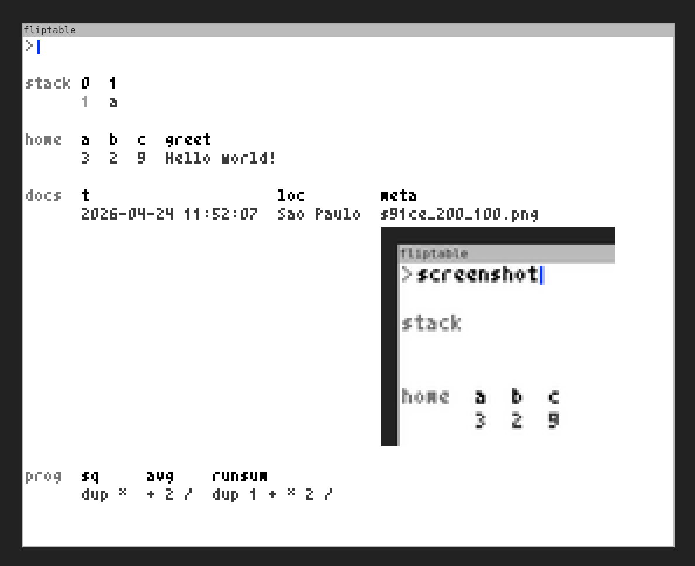
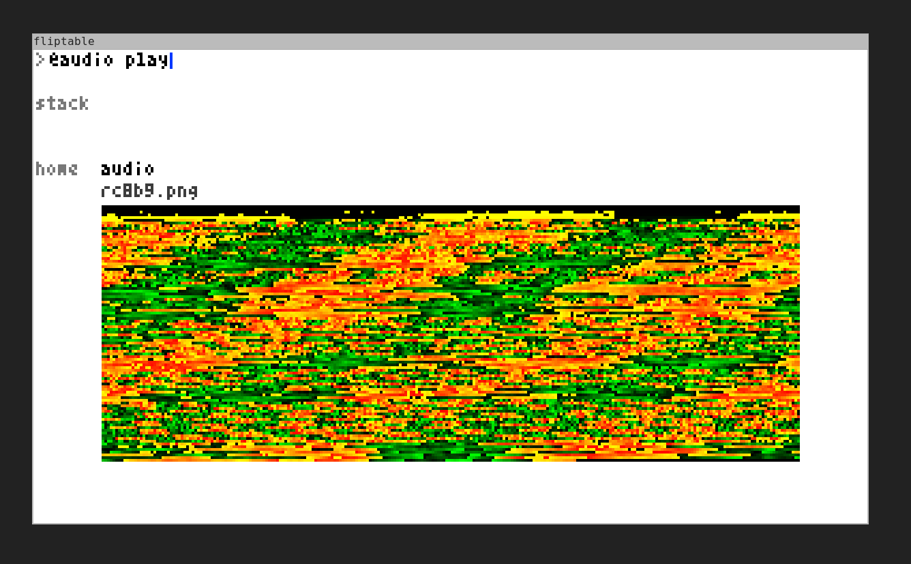
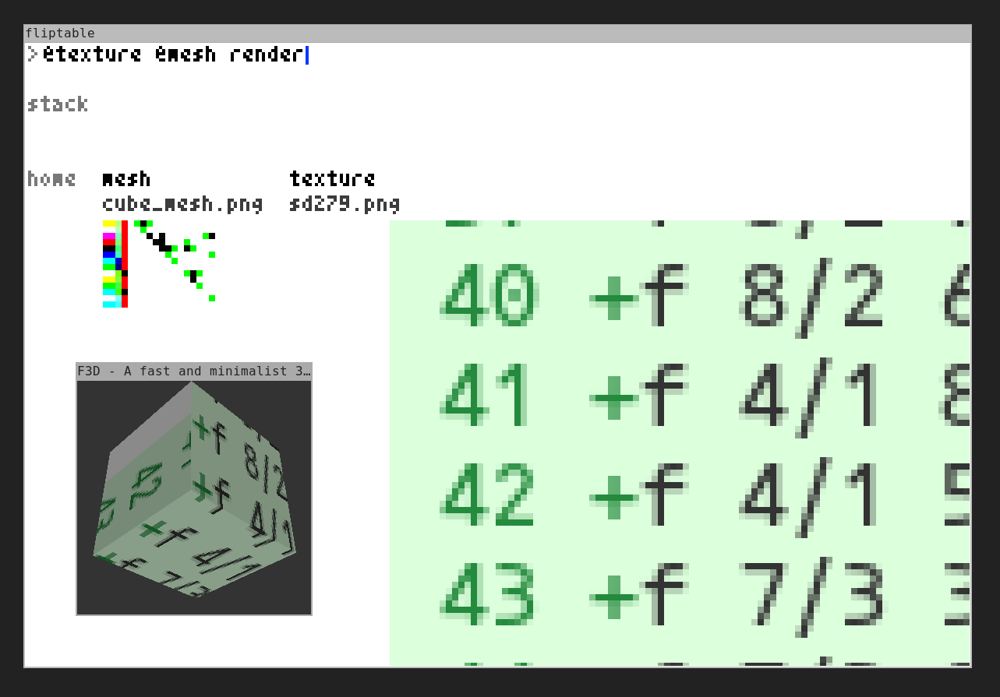

**Full disclosure: this project is aggressively vibe-coded. The emphasis is on
the "everything is an image" concept, and *not* the implementation.**

# Aguafuerte

An image-based programming system, with a Forth-like stack REPL.

State is stored as a single PNG image, making snapshots first-class.
Text is rendered with a 3x6 bitmap font directly into RGB pixels.
This facilitates reconstruction of state, but should not be considered essential.

All variables are a (k,v) pair.
Keys are strings. Values are strings, integers, or images.

Keys use dot-separated namespaces. The part after the last dot
is the local key; everything before it is the namespace.
Keys without a dot go into the `home` namespace.

    30 age SET                -> home.age = 30
    90 metrics.cpu SET        -> metrics.cpu = 90

Each namespace is a visual row in the image.

### Types

1. **Variables** — (key, value) text or number
2. **Procedures** — strings executed via `EXEC`
3. **Images** — (key, path, pixel data)
4. **Audio** — images encoding PCM-as-pixels
5. **Mesh** — images encoding OBJ connectivity matrices
6. **Commands** — (key, script path, rendered script text)
7. **Processes** — (key, pid) a running command

### Basics

     3 4 + .                  -> 7
    10 3 - .                  -> 7
     6 7 * .                  -> 42
    10 3 / .                  -> 3
    10 3 % .                  -> 1
    
    val key SET               set key to value
    key GET                   push value of key
    @key                      shorthand: fetch and push
    key DEL                   delete key or namespace
    
    DUP                       duplicate top
    DROP                      discard top
    SWAP                      swap top two
    a b CAT                   concatenate two values

    EXEC                      pop text, execute as Forth
    .                         pop and print top of stack
    quit / exit               close the program

### Procedures

    "2 *" double SET          store a procedure
    5 double GET EXEC .      -> 10
    5 @double EXEC .         -> 10 (shorthand)

### Commands & Processes

Commands are bash scripts loaded from `commands/*.sh`. On startup,
all scripts are loaded into the `sys` namespace. Arity is auto-detected
from `$1`..`$9` references in the script.

    screenshot spawn wait     take a screenshot
    5 record spawn wait       record 5 seconds of audio
    img 100 resize spawn wait resize to 100x100

SPAWN pops args (based on arity) then the command, forks the script,
and pushes a Process onto the stack. WAIT pops the process, blocks
until it finishes, and pushes the result (if the script echoes a filename).

Image args are materialized as temp files before being passed to scripts.

Built-in commands (`commands/`):

    screenshot                interactive screenshot (scrot -s)
    secs record               record mic for N seconds
    img size resize            resize image
    img edit                  open in gthumb
    audio play                play PCM-as-pixels audio
    obj render                open mesh in f3d

### Media

    path READ                 load image, text, audio, OBJ, or .sh command
    TIME                      push time (YYYY-MM-DD HH:MM:SS)
    LOCATION                  push city via IP geolocation

Image cells are three rows: key, file path, and pixel data. 

The file path enables re-linking to the source file for image operations.
If an image cell's source file is missing from disk, it is re-created
from the pixels stored in the database image.

### Editing

    val EDIT                  push text/number back to CLI for editing

For text and numbers, EDIT places the value (quoted) in the input line so
you can modify it before submitting.

### Audio

    "song.mp3" READ           decode audio to PCM-as-pixels
    audio play spawn wait     play audio image via ffplay
    5 record spawn wait       record from mic for 5 seconds

Audio files (.mp3, .wav, .ogg, .flac, .aac, .opus) are decoded via ffmpeg
to 8kHz mono 16-bit PCM. Each sample is stored as one pixel: R = high byte,
G = low byte, B = 0. A 10-second clip produces a 256x313 image.

Since PNG is lossless, audio survives save/load round-trips perfectly.

### 3D Geometry

    "model.obj" READ              load OBJ as connectivity matrix image
    obj render spawn              open in f3d

OBJ files are parsed and encoded into a single image. Vertices with
different UV mappings are duplicated so each vertex has a unique UV.
For N (deduplicated) vertices, the image is N rows by (N+4) columns:

- Columns 0-1: vertex position (X, Y, Z as 16-bit per axis across 2 pixels)
- Columns 2-3: UV texture coordinates (U, V as 16-bit across 2 pixels)
- Columns 4+: NxN adjacency matrix (face connectivity)

Adjacency encodes face triangles: for edge (i,j) where i < j, the pixel
stores R=k1, G=k2 (the third vertex of each triangle sharing that edge),
B=1. White pixels (255,255,255) mean no edge.

### Persistence

    name SAVE                 save db to images/name
    name LOAD                 load db from file
    
Save writes the database image to `images/`. On load, the cell structure
(rows, keys, values, images) is reconstructed by scanning the pixel data:

- Namespace labels are read from the left column
- Cell keys are decoded from the bitmap font
- Values are detected as text (gray pixels) or image data
- Image cells include a file path header above the pixel data

### Theme

Colors are defined in `THEME.txt` (parsed on startup):

    bg              255 255 255
    text            0   0   0
    text_dim        60  60  60
    text_faint      120 120 120
    scroll          180 180 180
    cursor          0   56  255
    command         0   56  255
    process         200 120  0
    grid            200 220 255

Edit `THEME.txt` to customize the color scheme. Missing entries
use the built-in defaults.

### Utility

    ns pos PIN                move namespace to position (0 = first)

## Keyboard shortcuts

    Ctrl +/-                  scale images up/down (text stays fixed)
    Ctrl Up/Down              scroll vertically
    Ctrl Left/Right           scroll horizontally
    Shift + scroll            scroll horizontally
    Ctrl g                    display the bit-map font grid

## Files

    src/main.c         REPL + SDL2 window + keyboard input
    src/db.h/c         Database, cells, rows, PNG I/O, reconstruction, theme
    src/eval.h/c       Forth-style stack evaluator
    src/audio.h/c      Audio PCM-as-pixels encoding/decoding
    src/geometry.h/c   OBJ parsing and connectivity matrix encoding
    src/glyph.h/c      3x6 bitmap font (read and write)
    src/cli.h/c        User input
    commands/          Shell scripts for system commands
    THEME.txt          Color scheme
    deps/              stb_image headers
    install.sh         dependency installer
